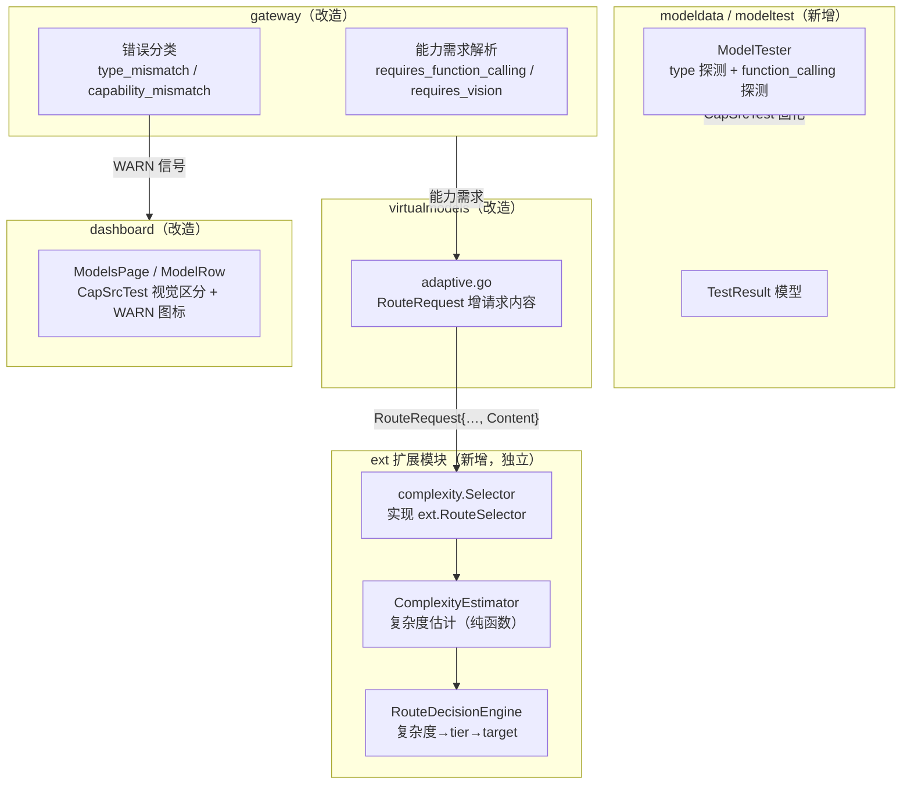

# 架构设计：能力判定与动态路由体系

> 日期：2026-09-06 ｜ 状态：待评审
> 关联：需求说明.md（本目录）、`../adr/0008-virtual-models.md`、`../dev/2026-09-05_architecture-4plus1-view.md`

---

## 1. 现状（as-is）

### 1.1 模型注册与判型（已有）

```
供应商注册（providers/factory.go）
  → ListModels 自动发现 → discoveredByProvider（registry_cache.go / registry_init.go）
  → enrichModelsLocked 三级富化（modeldata/enricher.go）：
      1. enrichProviderModelMaps → catalog Resolve（providerType/modelID 精确匹配）
      2. applyConfigMetadataOverrides（config.yaml 元数据）
      3. applyInferredModelMetadata → InferModesFromID（ID 启发式兜底，默认 chat）
```

- 能力判定单一真源：`modeldata/infer.go`（`InferModesFromID`/`InferCapabilitiesFromID`/`IsVisionModelID`/`ApplyCapabilityBlacklist`）。
- 能力存 `ModelMetadata.Capabilities map[string]bool` + `CapabilitySources map[string]string`（`CapSrcRegistry/Discovered/Config/Heuristic`）。
- 能力消费现状：仅 `providers/registry_list.go` 的 `capabilityToCategory`/`modelMatchesCategory` 做 dashboard 分类计数。

### 1.2 虚拟模型与自适应扩展点（已有）

- `virtualmodels` 4 策略：round_robin（加权）/ cost（最便宜）/ adaptive（`ext.RouteSelector`）/ failover；另有 sticky、chain（深度≤8）、限流容量探测。
- `ext.RouteSelector`（`ext/route.go`）：`Select(RouteRequest)` 从候选池选 target；`RouteRequest{Source, SessionID, SessionTarget, Candidates[]}`；`RouteCandidate{Provider, Model, Qualified, Weight, InputPerMtok, OutputPerMtok}`。
- **关键缺口**：`RouteRequest` 无请求内容；`Select` 在模型解析阶段被调用（`virtualmodels/resolve.go → balancedResolution → adaptiveTarget`），此时请求 messages 尚未传入。

### 1.3 问题总结

1. 判型无实测验证（本地/自命名模型不可靠）。
2. 能力检测结果不进路由。
3. 无复杂度感知路由。
4. 运行时类型/能力错误静默。

---

## 2. 目标架构（to-be）



核心：三个工作流（W1 复杂度路由 / W2 模型实测 / W3 运行时告警）围绕「静态能力表」形成闭环，见需求说明 §3.1。

---

## 3. 模块详细设计

### 3.1 W1 复杂度感知路由

**3.1.1 复杂度估计器（CE）**

纯函数、无状态、无 I/O。输入：归一化后的 messages/tools 摘要；输出：`(ComplexityLevel, score)`。

- 特征（移植自 model-router，按 GoModel 流量重定参数，见 AD-3）：
  - 当前消息长度、平均用户消息长度、消息数、用户轮次、tool 调用数/比例、`has_code`（代码围栏检测）、`has_multi_step`（多步列表检测）、上下文长度。
- 归一化：log 缩放 + 分位参考；分级阈值走配置（试运行用人工经验值，见 AD-4）。

**3.1.2 决策引擎（DE）**

`复杂度 → tier → target` 两级：
1. 复杂度分级映射 tier（simple/medium/complex/very_complex → 每 tier 配 primary/upgrade/fallback）。
2. tier 内按策略选 target（复用现有 candidate 池，含 cost 策略 + 权重）。

**3.1.3 能力进路由（FR-4）**

- 请求侧（gateway，纯解析）：`requires_function_calling`（`req.Tools` 非空）、`requires_vision`（messages 含 `image_url` ContentPart）。
- 候选侧：`RouteCandidate` 增 `Capabilities map[string]bool`（从 catalog 深拷贝，沿用 `adaptive.go:48-53` 的 `copyPrice` 防篡改模式）。
- 过滤语义（D/Q3）：`vision` **硬过滤**（模型无 vision 且请求带图 → 剔除）；`function_calling` **软偏好**（优先 capable，全未标注/为 false 仍降级路由 + WARN）。tier 内全不满足 → fallback 最近 capable tier。

**3.1.4 `RouteRequest` 内容扩展（难点 1）**

沿 `PrepareChatRequest`（已持 `req.Messages`）→ `ensureTranslatedRequestWorkflow` → `ResolveRequestModelWithAuthorizer` → `ResolveExecutionSelector` → `ResolveModelForUserPath` → `resolveRequested` → `balancedResolution` → `adaptiveTarget` 把请求内容（messages/tools 的**轻量摘要**，非全文）thread 进 `RouteRequest.Content`。改动是机械的，但穿透 `ModelResolver` 接口边界，属受控 ext API 扩展。

### 3.2 W2 模型实测验证

**3.2.1 ModelTester（新增，`internal/modeldata/modeltest`）**

- 探测类型（FR-7 首期）：
  - **type**：按 endpoint 探测——`/chat/completions`（小载荷）、`/embeddings`（小载荷）等，看哪个 endpoint 成功响应 → 确定 mode。
  - **function_calling**：发带 `tools` 的请求（`tool_choice=auto` + 明确诱导工具调用的 prompt），看 `message.tool_calls` 是否非空。
- 结果三态：`pass`（确认）/ `inconclusive`（未命中或网络失败）/ 不设 `fail`——**negative 不覆盖**（D2）。
- 并发与预算：手动触发，探测并发受限 + 最小载荷（`max_tokens` 极小）。
- 复用：多协议 provider client（chat/embeddings 已有）直接发探测；连通性探测复用 `ResolveRefreshTarget` 雏形。

**3.2.2 结果固化**

- 新增 `CapSrcTest` 能力来源（`core/types.go` 枚举 + `Clone()`/`MergeMetadata` 深拷贝同步）。
- operator 确认后写入 models.json `capabilities` 字段 / config override——复用现有 `MergeMetadata`（config/registry 胜出）与 `applyConfigMetadataOverrides` 通道。

**3.2.3 视觉系统（D1+）**

- dashboard `ModelRow`/`ModelsPage`：每条能力标注来源徽标（静态判型 = 默认色 / 模型测试 = 强调色「已实测」）。
- 判定来源直接读 `CapabilitySources`（已存在），主要是 UI 渲染工作 + 一个新枚举值。

### 3.3 W3 运行时错误告警

**3.3.1 检测（难点：需定义信号）**

- **类型错误**：endpoint↔mode 不匹配（现有 `CapabilitiesForEndpoint(endpoint)` 已有雏形）+ 上游 404/400（如「model X is not a chat model」）。
- **能力错误**：请求要求 function_calling/vision，但模型响应表明不支持（如忽略 tools、或上游明确报「tools not supported」）。
- 检测点：gateway failover 层 + `llmclient` 错误分类层。

**3.3.2 记录 + 展示**

- 记录：写入审计日志（`internal/auditlog`，已记录 status_code/err）——AD-5 定稿：复用审计日志，不引入独立信号表。
- 展示：模型模块 WARN 图标（该模型近期有类型/能力错误），点击可见错误明细，提示 operator 触发模型测试。

---

### 3.4 W2b 被动观测（审计日志挖掘）

**3.4.1 轻量结构化信号字段（FR-10）**

`LogData` 增 3 个布尔字段（不落请求/响应全文，按列可过滤，隐私与存储成本最小）：
- `had_tools`：请求带 `tools`
- `response_tool_calls`：响应含 `tool_calls`
- `had_image`：请求含 `image_url` ContentPart

采集点：gateway 侧请求/响应解析处打标（与 `LogData` 组装同路径）；`StatusCode`/`ErrorType`/`ErrorCode` 复用现有核心字段，无需新存。

**3.4.2 聚合器（FR-11）**

后台聚合（增量/周期，复用审计日志读接口 `reader.go`），按 `resolved_model` 分组，统计**去重会话数**：
- `had_tools ∧ response_tool_calls` 去重会话数 ≥3 → 建议「支持 function_calling」
- `had_tools ∧ 上游 tools 拒绝错误` 去重会话数 ≥3 → 建议「不支持 function_calling」
- `had_image ∧ 2xx` 去重会话数 ≥3 → 建议「支持 vision」

产出 `CapabilitySuggestion`，**不自动固化**——进入 dashboard 待确认队列，operator 确认后才写 models.json/config（`CapSrcObserved`）。

**3.4.3 与主动探测的分工**

- 主动探测（W2a）覆盖**零流量/新注册模型**的首次判型 + 强制提问。
- 被动观测（W2b）覆盖**有流量模型**的持续验证 + 真实流量证据。
- 共用同一固化通道（`CapSrcTest`/`CapSrcObserved` → models.json/config），共享 D2「negative 不覆盖」语义（观测负面仅认上游显式报错）。

---

## 4. 集成点

| 宿主 | 形态 | 现状 | 接入方式 |
|------|------|------|----------|
| `ext.RouteSelector` | 扩展契约 | 已有（`ext/route.go`） | W1 的 selector 实现注册进 `ext.Registry` |
| `virtualmodels/adaptive.go` | 策略分发 | 已有 | `RouteRequest` 增内容字段 + 深拷贝能力 |
| `gateway` | 请求编排 | 已有 | 能力需求解析 + 内容摘要 thread 进 resolution |
| `modeldata` | 目录/判型 | 已有 | 新增 `modeltest` 子包（主动探测）+ 聚合器（被动观测）+ `CapSrcTest`/`CapSrcObserved` 来源 |
| `providers/registry` | 富化/计数 | 已有 | 实测固化走 `applyConfigMetadataOverrides` |
| `llmclient` + gateway failover | 错误分类 | 已有 | W3 检测点 |
| `internal/auditlog` | 审计 | 已有 | W3 信号落点 + W2b 轻量字段（`had_tools`/`response_tool_calls`/`had_image`） |
| `web/dashboard/src/pages/models/` | 模型模块 UI | 已有 | 视觉区分 + WARN 图标 + 测试入口 |

---

## 5. 模块改动清单

| 模块 | 改动 | 类型 |
|------|------|------|
| `ext/route.go` | `RouteRequest` 增 `Content` + `RequiredCapabilities`；`RouteCandidate` 增 `Capabilities` | 扩展契约 |
| `internal/virtualmodels/adaptive.go` | 组装 Content/能力进 `RouteRequest`，深拷贝能力 | 改造 |
| `internal/gateway/inference_prepare.go` | 请求内容摘要 + 能力需求解析 → thread 进 resolution 链 | 改造 |
| `internal/gateway/request_model_resolution.go` | 透传 Content 参数 | 改造 |
| 新 `ext`/`internal` 模块 | `ComplexityEstimator` + `RouteDecisionEngine` + `complexity.Selector` | 新增 |
| `internal/modeldata/modeltest/` | `ModelTester` + 探测 + 结果模型 | 新增 |
| `internal/modeldata/infer.go` 旁 | `CapSrcTest` 来源枚举 | 扩展 |
| `internal/core/types.go` | `CapabilitySource` 枚举 + 深拷贝同步 | 扩展 |
| `internal/admin` | `POST /admin/models/test`、`GET /admin/models/test-results`、`PUT /admin/models/capabilities` | 新增 |
| `llmclient` / gateway failover | 类型/能力错误分类 + W3 信号 | 改造 |
| `internal/auditlog` | W3 信号记录 + W2b 轻量字段（`had_tools`/`response_tool_calls`/`had_image`） | 改造 |
| 新 `internal/modeldata`（聚合器） | 被动观测聚合器 + `CapabilitySuggestion` 建议队列 | 新增 |
| `web/dashboard/.../models/` | 视觉区分 + WARN 图标 + 测试入口 + i18n | 改造 |
| `docs/` | 配置手册（`config-manual.md`）同步新配置段 | 文档 |

---

## 6. 关键设计决策

- **AD-1** 复杂度路由作为 `ext.RouteSelector` 扩展实现，不进 core——`adaptive` 策略本就是为此预留的「pro extension」注入点（`ext/route.go` 注释明示），上游合并面最小。
- **AD-2** `RouteRequest` 携带**轻量摘要**而非全文 messages——避免把完整请求体塞进扩展契约（体积 + 序列化成本 + 敏感数据面）；摘要字段（长度/计数/has_code/has_multi_step/tool 数）已足以支撑复杂度估计，能力需求（requires_function_calling/vision）单独成字段。
- **AD-3** 复杂度特征/权重**不照搬** model-router（其 88 会话标定），首期用简化特征 + 人工经验阈值，试运行后以审计日志重校准（数据先行原则）。
- **AD-4** 阈值配置化 + 热更新：复用 config reload + snapshot 热换，试运行期间免重启调参。
- **AD-5** W3 信号存储：复用审计日志（已有关联字段 status/err/session），不引入独立信号表；告警查询由专项聚合端点实现（`GET /admin/models/capability-errors`：近期窗口内按 resolved 模型聚合 kind/次数/最近发生时间，数据源仍是审计日志）。若未来告警查询成为热点再评估独立。
- **AD-6** 实测结果不落 `ModelCache`（`internal/cache/modelcache` 只存 ID/Created）——延续「能力检测确定性派生、不耦合运行时缓存」的持久化决策，固化走 models.json/config。
- **AD-7** 被动观测信号字段 = 3 个布尔（`had_tools`/`response_tool_calls`/`had_image`），不落全文——能力证据只需「是否」，不需正文，隐私与存储成本最小。
- **AD-8** 被动观测聚合 = 自动聚合（≥3 去重会话）产生「支持/不支持」建议，**operator 门控确认后才固化**——观测证据自动生成、人工把关，延续 D1/D4 手动哲学，避免误杀。

---

## 7. 测试策略

- **单元测试**：`ComplexityEstimator`（特征提取/分级边界/阈值）、`RouteDecisionEngine`（各策略/tier 映射/fallback）、能力过滤（硬/软语义）、`ModelTester`（三态结果/INCONCLUSIVE 永不误杀/探测载荷）。
- **契约测试**：`ext.RouteRequest` 扩展前后兼容性（旧 selector 不受影响）；`adaptive.go` 深拷贝防篡改。
- **集成测试**：`RouteRequest` 内容 threading 全链路（Prepare → resolution → Select 拿到摘要）；实测结果固化进 enrichment 管道。
- **回归**：现有 `go test ./internal/modeldata/... ./internal/providers/... ./internal/virtualmodels/...` 全绿；能力检测默认推断变更会红一批旧断言（行为变化非回归，逐个改新默认）。
- **探针测试**：探测请求构造（最小载荷、tool 诱导 prompt）用 mock 上游验证。

---

## 8. 待裁决 / 待办

| 项 | 内容 | 状态 |
|----|------|------|
| 待办 | `vision`/`audio` 能力探测（D3） | 已记录，二期 |
| 待办 | 复杂度阈值审计日志 K-Means 重校准（Q4） | 试运行一月后进行 |
