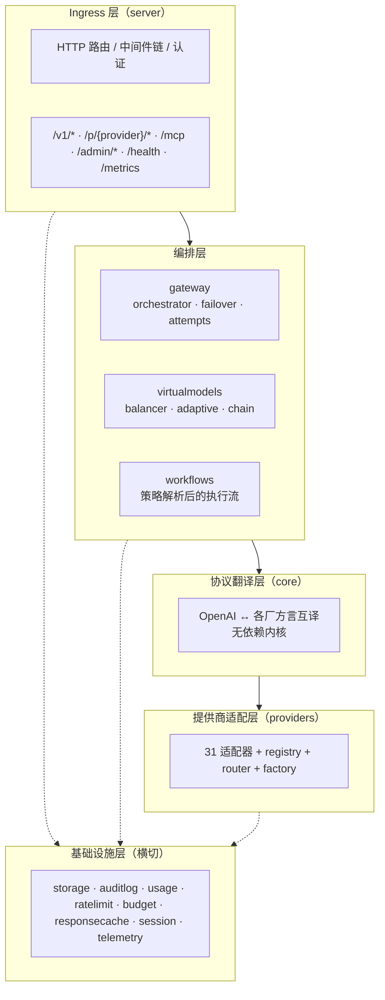
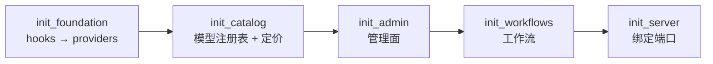
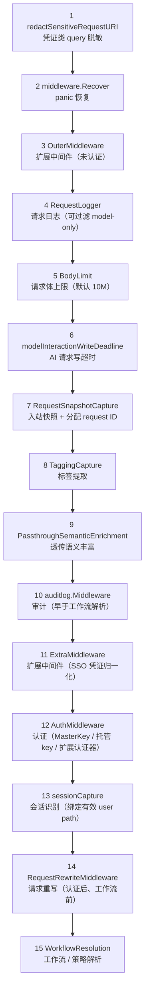
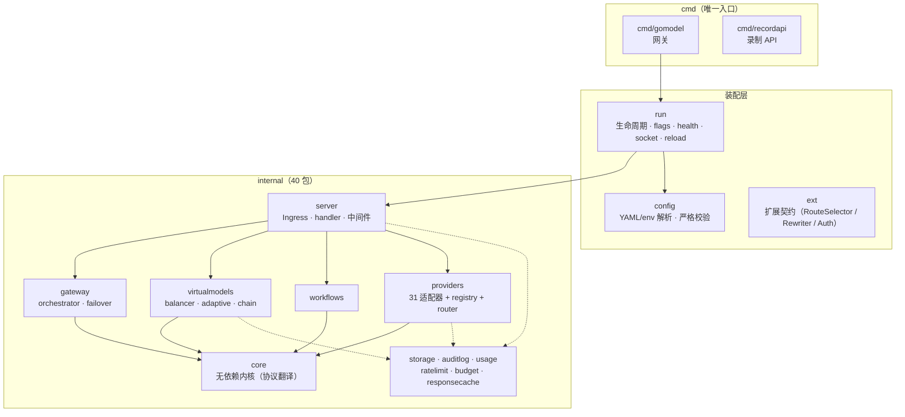
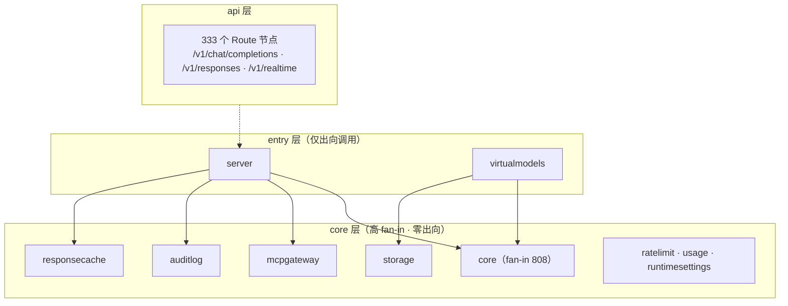
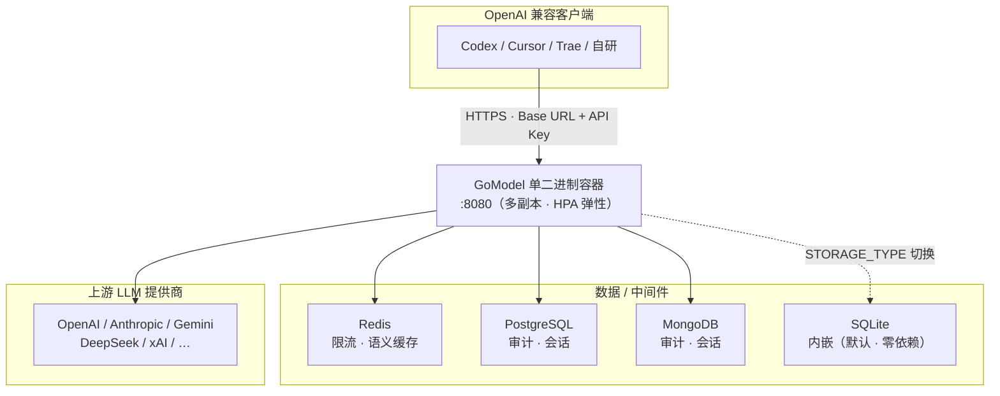
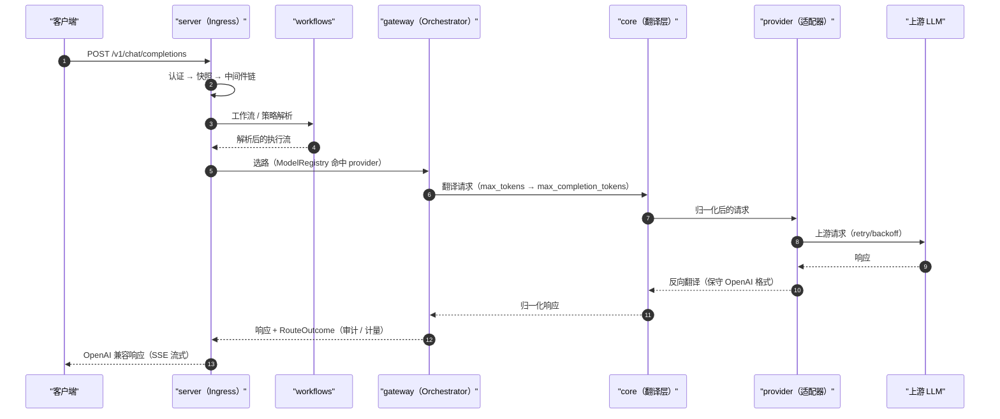
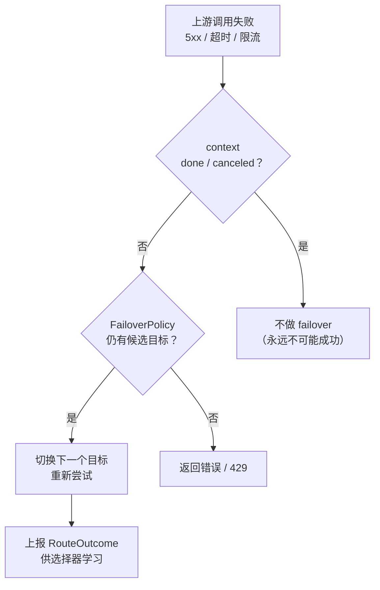
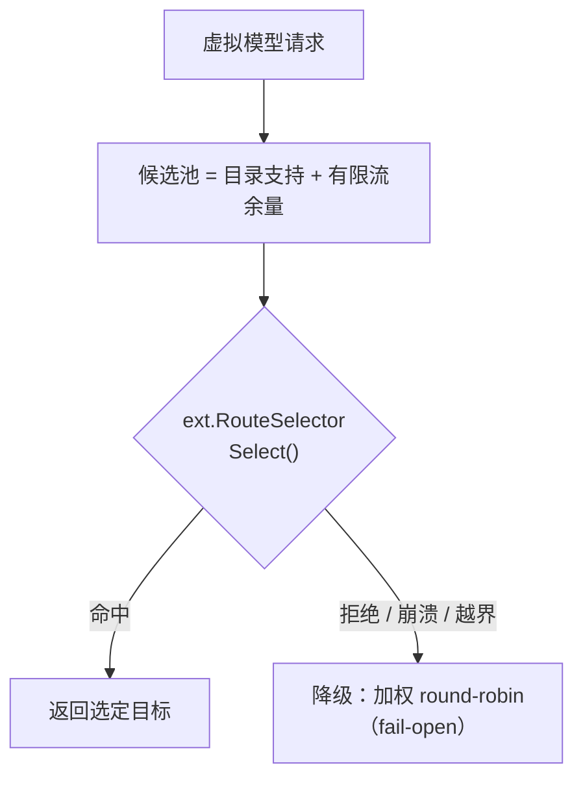

# GoModel 架构设计分析：4+1 视图

- 日期：2026-09-05
- 依据：codebase-memory 知识图谱（23,490 节点 / 122,873 边，full 索引 2026-09-03）+ 源码实测（go.mod、`server/http.go`、`core/interfaces.go`、`providers/factory.go`、`ext/route.go`、`virtualmodels/adaptive.go`）
- 关联：ADR-0012（图派生架构总览，本文件为 Kruchten 4+1 视图的正式化补充）

---

## 0. 一句话定位

GoModel 是一个**单二进制、高吞吐、轻量级 AI 网关**，对外暴露 OpenAI 兼容 API，对内把请求路由到 30+ 家 LLM 提供商，并在此过程中完成协议翻译、负载均衡、故障转移、语义缓存、预算/限流、审计与成本计量。核心哲学是 **Postel 定律**（入口宽松接收、出口保守输出）与 **十二要素 / KISS**。

---

## 1. 技术栈

### 1.1 运行时（后端）
| 维度 | 选型 | 说明 |
|---|---|---|
| 语言 | **Go 1.27**（module `github.com/enterpilot/gomodel`） | 单二进制，goroutine 高并发 |
| Web 框架 | **labstack/echo/v5** | 路由 + 中间件链 |
| JSON | **goccy/go-json**（序列化）+ **tidwall/gjson**（解析） | 高吞吐，路径上刻意少分配 |
| 可观测性 | **OpenTelemetry**（otel SDK + echo-opentelemetry + OTLP exporters）+ **Prometheus client_golang** | 双管线（ADR-0009） |
| 日志 | `log/slog` + `lmittmann/tint` | 结构化日志 |
| 存储 | **modernc.org/sqlite**（纯 Go 内嵌）\| **jackc/pgx/v5**（PostgreSQL）\| **go.mongodb.org/mongo-driver/v2** | 审计/会话/响应/虚拟模型 多后端可切换 |
| 缓存 | **redis/go-redis/v9** | 限流计数、语义缓存 |
| MCP | **modelcontextprotocol/go-sdk** | MCP 聚合网关 |
| 实时 | **coder/websocket** | `/v1/realtime` WebRTC/WS |
| 云 SDK | AWS SDK v2（Bedrock）、google oauth2 | 云提供商直连 |
| 文档 | **swaggo/swag**（OpenAPI 生成 + Swagger UI） | |
| CLI | urfave/cli/v2 | 命令行参数 |
| 重试 | cenkalti/backoff/v5 | 传输层退避 |
| 测试 | stretchr/testify | 10,389 条 TESTS 边 |

### 1.2 前端（管理面）
`web/dashboard/`：**Svelte 5** + **Vite 8** + **Chart.js 4**（图表）+ **lucide**（图标）+ **@inlang/paraglide-js**（i18n，en/pl/zh 三目录）+ TypeScript（svelte-check）。与 Go 运行时仅通过 `/admin/*` REST + SSE（live logs）解耦。

### 1.3 部署
**Dockerfile**（单二进制）→ **docker-compose**（gomodel + redis + postgres + mongodb + adminer）→ **Helm chart**（deployment / hpa / service / ingress / pdb / servicemonitor）+ **Prometheus** 抓取。

---

## 2. 逻辑视图（Logical View）

### 2.1 分层架构

### 2.2 核心抽象与职责

| 组件 | 位置 | 职责 |
|---|---|---|
| `Server` / `Handler` | `internal/server` | HTTP 入口、中间件链装配、路由注册（`http.go` 693 行） |
| `core.Provider` | `internal/core/interfaces.go` | 提供商最小契约（ChatCompletion / Stream / ListModels / Responses / Embeddings） |
| `core.RoutableProvider` | `internal/core` | Provider + `Supports(model)` / `GetProviderType(model)` 选路能力 |
| `Router` / `ModelRegistry` | `internal/providers` | 模型→提供商注册表，选路核心（registry cluster，cohesion 0.73） |
| `ProviderFactory` | `internal/providers/factory.go` | 提供商注册 + 构造（工厂 + 注册表） |
| `gateway.InferenceOrchestrator` | `internal/gateway` | 请求编排：准备→执行→失败转移 |
| `virtualmodels.Service` | `internal/virtualmodels` | 负载均衡 / 自适应 / 链式虚拟模型 |
| `ext.RouteSelector` | `ext/route.go` | 自适应选路扩展契约（策略注入点） |
| `responsecache` | `internal/responsecache` | 语义缓存（exact → embed → pgvector） |
| `workflows` | `internal/workflows` | 策略解析后的请求执行流 |
| 横切 | admin / auditlog / usage / ratelimit / budget / guardrails | 管理面与治理 |

### 2.3 关键设计：接口隔离 + 能力模型
`core/interfaces.go` 定义了**一组小而可选的接口**（`AudioProvider`、`ImageProvider`、`ImageEditProvider`、`NativeBatchProvider`、`NativeFileProvider`、`NativeResponseLifecycleProvider` …），Router 通过 **接口断言（type assertion）** 发现每个提供商的能力，能力不齐的提供商只需实现其支持的子集。这是「能力模型 + provider attempts」ADR-0004 的实现形态。

---

## 3. 进程视图（Process View）

### 3.1 运行时进程
- **单进程**：`cmd/gomodel` → `run.Run()` → `app.New()`，一个 Go 进程承载 HTTP 服务 + 后台协程。
- **并发模型**：echo + goroutine-per-request；流式 SSE 由独立 goroutine 泵送；WebSocket 实时链路长连接。
- **后台任务**：语义缓存写入有界 worker pool、提供商健康探测 tracker、运行时配置热刷新、每日版本检查。
- **优雅关闭**：`GracefulDrainTimeout`（10s，明确是「截止」而非承诺）< `run.shutdownTimeout`，先放行短请求、后 flush usage/audit、再关 DB——该时序关系由 `run` 包测试断言。

### 3.2 启动（bootstrap）阶段顺序

`bootstrap` 结构体显式标注各阶段的依赖序（hooks 先于 providers、audit 先于 workflows、所有可失败步骤先于端口绑定）。

### 3.3 请求中间件链（顺序即语义，`server/http.go:270-395`）

### 3.4 并发与状态纪律
- 负载均衡计数器 `sync.Map` 挂**长命 Service**，snapshot 热换不丢计数（`balancer.go`）。
- 自适应选择器运行在请求路径上：`recover()` 隔离扩展 panic，仅记录安装期固定元数据（防二次 panic），降级 round-robin（`adaptive.go`）。
- 定价候选**深拷贝**传给扩展，防篡改共享 registry。

---

## 4. 开发视图（Development View）

### 4.1 代码组织（40 个 `internal/` 包 + 2 个 `cmd/`）

### 4.2 分层归类（图计算）

### 4.3 热区（fan-in，改动需谨慎）
`server.New`(387) > `core.NewInvalidRequestError`(335) > `responsecache.exchange.Context`(327) > `server.Close`(262) > `runtimesettings.Store.Set`(236) > …

---

## 5. 物理视图（Physical View）

### 5.1 部署拓扑

### 5.2 存储后端可切换（十二要素 + 良好默认值）
- `STORAGE_TYPE=sqlite`（默认，纯 Go 内嵌，零依赖开箱）\| `postgresql` \| `mongodb`
- Redis 作为缓存（限流计数、语义缓存写入队列）；`storage.Store` 接口抽象使后端可互换。
- `data/` 卷持久化 sqlite + pid + install identity（容器重建不丢状态）。

### 5.3 编排与监控
- **K8s**：Helm chart（HPA、PDB、Ingress、ServiceMonitor）。
- **本地**：docker-compose（redis/postgres/mongodb/adminer），`--profile app` 起应用 + Prometheus。

---

## 6. 场景视图（Scenarios，+1）

### S1. Chat Completions（翻译路径，最主路径）

### S2. 故障转移（Failover）

### S3. 虚拟模型自适应路由

### S4. 语义缓存命中
exact miss → embed 请求 → pgvector 相似度命中即返回缓存，不调上游；写入走有界 worker pool 防突发打爆向量库。

### S5. 管理面运维
管理员经 `/admin/*`（master key 或托管 key 门禁）管理提供商凭据、模型定价、限流、虚拟模型、workflow、guardrails；live logs 走 SSE 实时推送（gzip 对 SSE 豁免）。

### S6. MCP 聚合 / 实时
`/mcp` 聚合多 MCP server；`/v1/realtime`（WebRTC/WS）转发语音/实时翻译。

---

## 7. 设计模式清单

| 模式 | 证据（file） | 说明 |
|---|---|---|
| **工厂 + 注册表** | `providers/factory.go`（`ProviderFactory.Add/Create`） | 提供商按 Type 注册、按解析配置实例化 |
| **适配器** | `providers/`（31 适配器 → `core.Provider`） | 各厂方言统一到核心契约 |
| **门面** | `providers/router.go` | Router 聚合注册表 + 能力发现，对外单一入口 |
| **接口隔离（能力模型）** | `core/interfaces.go`（AudioProvider/ImageProvider/NativeBatchProvider…） | 小接口 + 类型断言发现能力 |
| **策略** | `ext/route.go`（RouteSelector）+ `gateway/failover_policy.go` | 选路 / 失败转移策略可插拔 |
| **责任链 / 管道** | `server/http.go` 中间件链 + workflows 执行流 | 15 级中间件按序处理 |
| **命令** | `ext.RequestRewriter`、`llmclient.Hooks` | 可组合的请求重写 / 生命周期回调 |
| **仓库（Repository）** | `internal/storage` / `conversationstore` / `responsestore` Store 接口 | SQL/Mongo 可互换持久化 |
| **观察者** | `llmclient.Hooks`（OnRequestStart/End/StreamFirstChunk） | 横切观测，`JoinHooks` 组合 |
| **装饰器** | `hooksWithProviderIdentity`（`factory.go:147`）、中间件包装 | 不改签名地叠加行为 |
| **快照（Snapshot）** | `virtualmodels/snapshot.go`、运行时 config 热刷 | 不可变快照热换，读多写少 |
| **熔断/优雅降级（fail-open）** | `virtualmodels/adaptive.go`（recover 隔离） | 扩展崩溃降级 round-robin，不拖垮请求 |
| **依赖注入** | `server.Config`（大量可选接口字段） | 构造器注入，解耦具体存储/缓存类型 |
| **建造者（分阶段）** | `app/bootstrap.go`（phases 序列） | 显式顺序的启动装配 |
| **有界 worker 池** | `responsecache` 写入队列 | 限流突发，保护向量库 |
| **单例（进程级服务）** | App 上注册的子系统、`sync.Map` 计数器 | 长命服务持有热状态 |

---

## 8. 权衡与债务（诚实评估）

1. **`server` 是 god-package 入口**：729 条出向调用，是唯一集成/编排层，改动需广回归（稠密 TESTS 边缓解）。
2. **`core` fan-in 808 且零出向**：可测试性极佳，但代价是与提供商专用逻辑分离，1,095 条 `SIMILAR_TO` 边提示存在可合并的近似重复。
3. **31 家原生适配矩阵**维护成本高；对「轻」定位而言，部分能力（MCP 聚合 / realtime / batch）与路由核心正交，属可裁剪面。
4. 前端（Svelte）与 Go 运行时仅经 `/admin/*` 解耦，边界清晰但意味着管理面能力受限于 admin API 契约。
