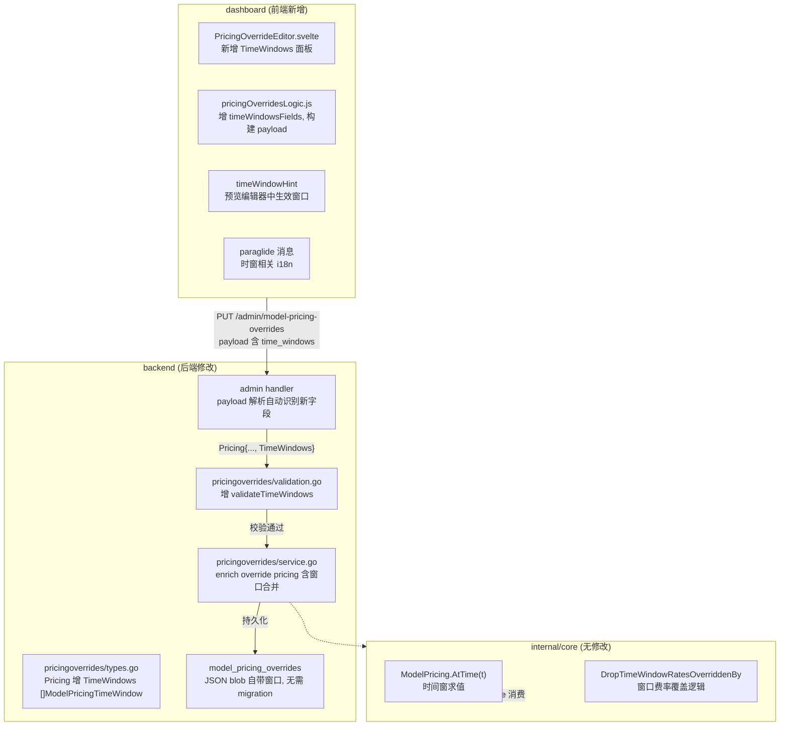

# 架构设计：控制台时间窗编辑

> 日期：2026-09-12 ｜ 状态：待评审
> 关联：需求说明.md（本目录）、`../../internal/core/pricing_timewindow.go`（AtTime 核心）、`../../internal/pricingoverrides/`（定价覆盖服务）

---

## 1. 现状（as-is）

### 1.1 定价数据流（已有）

```
下游消费:
  usage/recalculate_pricing.go:78      → pricing.AtTime(entry.Timestamp)
  usage/extractor.go:125               → pricing.AtTime(entry.Timestamp)
  usage/group_cache_stats.go:313       → resolver.ResolvePricing(...).AtTime(slotTime)
  virtualmodels/balancer.go:301        → model.Metadata.Pricing.AtTime(now)
  virtualmodels/adaptive.go:56         → model.Metadata.Pricing.AtTime(now)

上游生产:
  catalog (models.json)              → modeldata.FetchIfChanged → enrichProviderModelMaps
  config.yaml models[].metadata      → applyConfigMetadataOverrides
  └──── pricing.time_windows          → mergeConfigPricing (替换catalog)
  ──── pricing.input_per_mtok=...     → mergeConfigPricing (覆盖标量)

不包括: 定价覆盖 (pricingoverrides.Override) —— 当前不参与 enrichment，
        而是在 consumption 时通过 pricingOverridesResolver 合并。
```

### 1.2 定价覆盖数据流（已有）

```
admin API PUT/POST  ──→  pricingoverrides.Override  ──→  DB (model_pricing_overrides)
    {Pricing: {input_per_mtok: ..., output_per_mtok: ...}}
                                           ↑
                                           └── Pricing struct 无 TimeWindows

下游消费:
  usage/recalculate_pricing:78  → resolver.ResolvePricing → 查询 overrides → merge
  virtualmodels/balancer:301    → resolver.ResolvePricing → 查询 overrides → merge
```

### 1.3 问题总结

1. `pricingoverrides.Pricing` 结构体不含 `TimeWindows` → admin API 不接受窗口数据。
2. 前端 `pricingOverridesLogic.js` 无窗口编辑逻辑 → UI 不可见。
3. 覆盖基础价后 `DropTimeWindowRatesOverriddenBy` 隐式丢失 catalog 窗口折扣 → operator 可能误判成本。

---

## 2. 目标架构（to-be）



---

## 3. 模块详细设计

### 3.1 后端：`pricingoverrides/types.go`

**当前**：`Pricing` 和 `PricingTier` 在 `internal/pricingoverrides/types.go`。

**修改**：添加 `TimeWindows` 字段，复用 `core.ModelPricingTimeWindow` 类型，无需另建。

```go
import "github.com/enterpilot/gomodel/internal/core"

type Pricing struct {
    // … 原有标量字段 …
    Tiers       []PricingTier                  `json:"tiers,omitempty" bson:"tiers,omitempty"`
    TimeWindows []core.ModelPricingTimeWindow   `json:"time_windows,omitempty" bson:"time_windows,omitempty"`
}
```

**理由**：`core.ModelPricingTimeWindow` 已有完整的 yaml/json/bson 标签、`UTCRange` 解析、`Clone` 方法。复用避免类型重复。`Storage` 存的是 `json.RawMessage(Override.Pricing)` → `json.Marshal/Unmarshal` 自动含新字段。

### 3.2 后端：`pricingoverrides/validation.go`

新增函数：

```go
func validatePricingWindows(windows []core.ModelPricingTimeWindow) error {
    for i, w := range windows {
        if w.Label == "" {
            return fmt.Errorf("pricing.time_windows[%d].label is required", i)
        }
        if len(w.UTCRanges) == 0 {
            return fmt.Errorf("pricing.time_windows[%d].utc_ranges is required", i)
        }
        for j, r := range w.UTCRanges {
            // validate start/end format: "HH:MM"
            // validate day names: mon,tue,...,sun
            // validate start != end (unless wrapping)
        }
        if w.Pricing != nil {
            for _, field := range pricingScalarFields(*w.Pricing) {
                if field.value != nil && *field.value < 0 {
                    return fmt.Errorf("pricing.time_windows[%d].pricing.%s < 0", i, field.name)
                }
            }
        }
    }
    return nil
}
```

已有的 `validatePricing` 末尾串联：

```go
func validatePricing(p Pricing) error {
    // … 现有标量 + tiers 校验 …
    if err := validatePricingWindows(p.TimeWindows); err != nil {
        return err
    }
    return nil
}
```

### 3.3 后端：Service 层——覆盖合并策略

当前 `service.go` 的 `EnrichPricing` 逻辑（推导最终 effective pricing）：

```go
func (s *Service) EnrichPricing(base *core.ModelPricing, selector string) *core.ModelPricing {
    override := s.lookup(selector)
    if override == nil {
        return base
    }
    merged := mergePricing(base, override.Pricing)  // ← mergePricing 是现有的
    return merged
}
```

`mergePricing` 目前在 `registry_pricing_merge.go` 处理 config 覆盖。定价覆盖（`pricingoverrides`）的合并有自己的一份在 `pricingoverridesLogic.js` 的 `mergePricing`（前端侧）和 `applyPricingOverride` 链的类似逻辑。需要确保后端侧也正确处理 TimeWindows。

当前定价覆盖的后端合并路径：
- `usage/extractor.go:125`：通过 `pricingOverridesResolver.ResolvePricing` → `pricing[0].AtTime(entry.Timestamp)`，其中 `pricing[0]` 来自 catalog metadata（含 catalog 窗口），之后 `pricingForEndpoint(...)` 合并来自 pricing overrides 的标量覆盖。

实际上，阅读代码可以确认：`AtTime` 在 pricing 解析的早期（对 `pricing[0]`）调用，而不是在 override 合并之后。所以对于 usage 侧，override 叠加的标量并不通过 AtTime 求价。

这是现有实现的一个微妙的点。但增加 TimeWindows 到定价覆盖后，需要在 pricing override merge 链路末端（merged pricing 上）也支持 AtTime 求价。让我确认现有 merge 链是否已经考虑这个。

实际上看 `registry_pricing_merge.go` 的 `mergeConfigPricing`：
- 如果 override 有 TimeWindows → 替换 catalog 窗口
- 如果覆盖了标量但没设 TimeWindows → DropTimeWindowRatesOverriddenBy

在 `pricingoverrides` 域，类似逻辑应作用于 pricing overrides 对 catalog pricing 的叠加。

**建议实现**：在 `pricingoverrides/service.go`（或者新函数 `mergeOverridePricing`）复制 `mergeConfigPricing` 的时窗合并语义——因为现有 catalog+config 路径与 override 路径是分离的，`pricingoverrides` 在消费侧才叠加。

换句话说，本设计不改变 consumption 链的结构，只需保证：

1. `Pricing.TimeWindows` 能通过 admin API 写入和读取
2. UI 能提交带 TimeWindows 的 override payload
3. enrichment/consumption 侧现有的定价覆盖叠加逻辑能识别新的 TimeWindows 字段并正确传递
4. 当 override 有 TimeWindows 时，catalog 窗口被替换而不是丢弃

### 3.4 前端：`pricingOverridesLogic.js`

新增概念：时间窗行（time window rows），与标量字段行（`PRICE_FIELDS`）平行且独立的表单部分。

```javascript
export function timeWindowRowsFromOverride(override, nextID) { ... }
export function addTimeWindowRow(rows, nextID) { ... }
export function removeTimeWindowRow(rows, id) { ... }
export function updateTimeWindowUTC(rows, id, ranges) { ... }
export function updateTimeWindowPricing(rows, id, pricing) { ... }
export function buildTimeWindowsPayload(rows) { ... }  // → []time_window
export function validateTimeWindows(rows) { ... }
```

`buildPricingOverridePayload` 增加对 `timeWindows` 的收集。

### 3.5 前端：`PricingOverrideEditor.svelte`

新增 UI 区域，放在标量字段和阶梯价之后：

```
┌─────────────────────────────────────────────────┐
│ 基础价 + 阶梯价（已有）                          │
│  row: input_per_mtok → 0.30   [×]               │
│  row: output_per_mtok → 1.20  [×]               │
│  [+ Add field]                                   │
├─────────────────────────────────────────────────┤
│ 时间窗（新增）                                    │
│  ┌─ Window 1: off_peak ───────────────────────┐  │
│  │  utc_ranges:                                │  │
│  │    [mon-fri] [00:00] ←→ [01:00]  [×]      │  │
│  │    [mon-fri] [04:00] ←→ [06:00]  [×]      │  │
│  │    [+ Add range]                            │  │
│  │  Window pricing:                            │  │
│  │    input_per_mtok  [0.07]                  │  │
│  │    output_per_mtok [0.14]                  │  │
│  │  [× Remove window]                          │  │
│  └─────────────────────────────────────────────┘  │
│  [+ Add time window]                               │
├─────────────────────────────────────────────────┤
│ [预览有效定价] [取消] [保存]                      │
└─────────────────────────────────────────────────┘
```

行为：
- 时间窗列表展开/折叠（默认折叠，有窗口时展开）
- 每个窗口：label（输入框，默认 "off_peak"）+ UTC ranges 表格 + 窗口内费率下拉
- UTC range 行：day-of-week 多选（7个checkbox/select）+ start 输入（HH:MM）+ end 输入（HH:MM）+ 删除
- 添加 range 行：追加空行
- 窗口费率：下拉选择费率字段 + 输入值

### 3.6 前端：`categoryColumns.js` timeWindowHint 扩展

当前 `timeWindowHint` 从模型的 `pricing.time_windows` 渲染悬浮 `*` 标记。覆盖行为中，如果视图从 `modelRowPricingState` 提取有效定价，但 `modelRowPricingState` 当前的 `pricing` 从 `metadata.pricing` 合并 `override.pricing` 后，**原窗口只存在于 `metadata.pricing.time_windows`，不会被 override 替换**。

需要在 `modelRowPricingState` 中处理：当 override 设置了 `time_windows`，替换 `pricing.time_windows`。

```javascript
export function modelRowPricingState(row, views, ignoredSelector) {
    // … 现有 merge 标量逻辑 …
    // 新增：time_windows 替换
    if (patch && Array.isArray(patch.time_windows) && patch.time_windows.length > 0) {
        pricing.time_windows = clonePricing(patch.time_windows);
        sources.time_windows = overrideSource;
    }
    return { pricing, sources };
}
```

---

## 4. 模块依赖图

```
┌────────────────────┐
│  types.go          │  ← 新增 TimeWindows 字段
│  (Pricing struct)  │
└────────┬───────────┘
         │ admin handler 读/写
         ▼
┌────────────────────┐
│  validation.go     │  ← 新增 validatePricingWindows
│  (validatePricing) │
└────────┬───────────┘
         │ 前端通过 API 提交
         ▼
┌──────────────────────────────────────────┐
│  PricingOverrideEditor.svelte             │
│  + pricingOverridesLogic.js               │
│  + categoryColumns.js (timeWindowHint)    │
│  + paraglide i18n (<10 条新消息)           │
└──────────────────────────────────────────┘
```

---

## 5. 向后兼容性分析

| 变更点 | 旧数据/旧客户端 | 迁移措施 |
|--------|----------------|----------|
| `Pricing` 新增 `TimeWindows` 字段 | 旧 JSON 无此键 → `omitempty` 不序列化；旧行保持干净 | 无需迁移 |
| `PUT /admin/model-pricing-overrides` 旧 payload | 无 `time_windows` → `nil` → 行为同现在 | 无需迁移 |
| 前端编辑器旧逻辑 | 无窗口编辑区 → 新增面板可选展开 | 无需迁移 |
| DB 行 | `pricing` blob 无窗口 → AtTime 正常（沿用 catalog 窗口） | 无需迁移 |
| i18n 新消息 | 旧语言包缺翻译 → 回退英文 key | 同现有 i18n fallback 策略 |